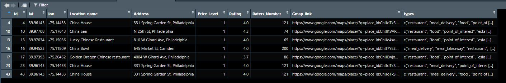

# ProximityLocationFinder_R
This repository contains R scripts designed to identify the top nearest points of interest for multiple addresses based on user-defined search parameters, applicable for various scenarios such as finding the closest restaurants or stores to customer addresses.

## Project Summary
This repository contains R scripts (Final_LocationAlocation_GoogleSearch.R) developed to identify the top closest locations of interest corresponding to multiple addresses. These locations are determined based on search parameters such as search radius, number of top closest locations, price range, operational status, and routing parameters, including real-time traffic conditions, departure time, and mode of transportation.
Essentially, the model takes a keyword or search query related to desired locations and a set of addresses to find the nearest points of interest. The output includes the top closest locations to these addresses, along with pertinent details such as location name, address, Google Map link, rating, and more.
This model can be utilized in various contexts; for instance, the addresses might belong to customers, and the locations of interest could be restaurants, gas stations, or any other entities based on the search query.
As an example, the provided script considers the addresses as those of customers, with the search locations being "Chinese restaurants" or stores. The number of top closest restaurants (parameter "m" in the script) is set to 7. The resultant table from this example is presented below.

## Proximity Location Model
This proposed model identifies the closest locations to multiple addresses. The process involves three simple steps:
1.	Location Identification: The script begins by identifying specific types of locations within a defined radius for each address, subsequently creating a related dataset.
2.	Sorting and Selection: The script then sorts the located spots for each address, ranging from the closest to the furthest. It retains only the top closest locations. The number of top close locations is determined by the "m" parameter value in the code.
3.	Count and Order: The script counts the number of times each location appears among the top closest spots for all addresses. Finally, it orders the locations by this count, from highest to lowest.
Through this method, the model effectively pinpoints the most frequently occurring close locations across multiple addresses.

## Google Maps API 
Get ready to experience the power of the Google Maps API! This script leverages the incredible capabilities of the Google Maps API and the user-friendly googlemaps library to perform routing and estimations.
By utilizing the google_directions() and google_places() functions, this script effortlessly conducts location searching,  routing calculations, providing accurate travel directions and estimations. It's like having a personal navigator right at your fingertips!
If you don't already have a Google Maps API, worry not! Obtaining a free API key is a breeze. Simply visit https://console.cloud.google.com and follow the instructions to get your hands on the API key. Oh, and don't forget to activate the "Direction API" in your Google Cloud portal for seamless functionality.
With the Google Maps API by your side, you'll unlock a world of possibilities for routing and estimations. Let's embark on this exciting journey and harness the power of location-based intelligence!
